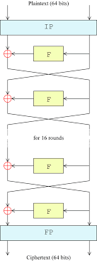
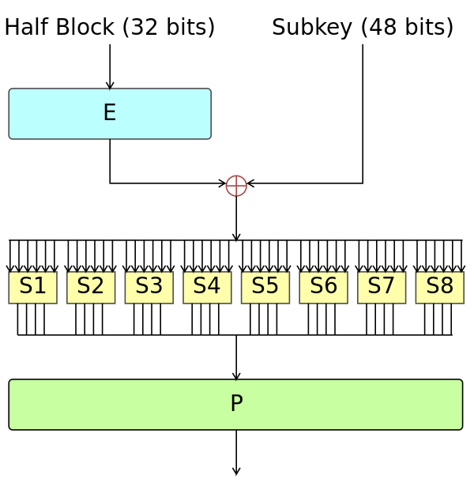
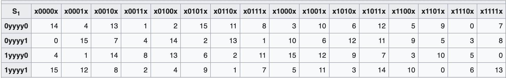
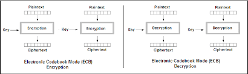
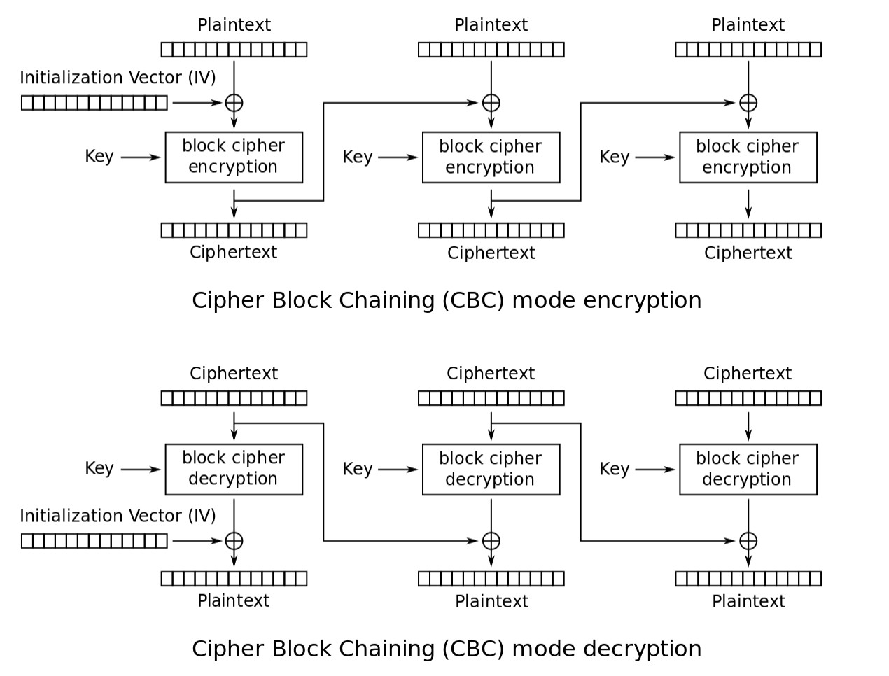

## DES Encryption

The Data Encryption Standard (DES) is a symmetric encryption algorithm that uses a block cipher. It was introduced in the 1970s, and was later deprecated in 2005 due to security concerns, and was replaced with the Advanced Encryption Standard (AES).

DES involves Fiestel Ciphers, which means that the encryption process is easily reversible (more on that later).
<!--- #### Symmetric encryption --->

### Block Cipher

DES also happens to be a block cipher. A block cipher is a cipher which operates on fixed-length groups of bits, called "blocks." It consists of two algorithms, an encryptor and a decryptor. The plaintext is broken into blocks of a certain length, and each block is then encoded.
[there's more to say, I'm pretty sure]
Both algorithms accept two inputs: an input block of size n bits and a key of size k bits; and both yield an n-bit output block.

### Fiestel Cipher

A Fiestel Structure is a design model used to build various symmetric block ciphers, like DES.

A fiestel cipher structure is symmetric, which means that passing text encrypted via a fiestel cipher through the fiestel cipher again (using the same key) undoes the encryption.
So running text through a fiestel cipher twice (using the same key) has no effect.

<!------>

It starts and ends with an initial/final permutation, between which the block is split in halfand goes through 16 rounds of: the right plaintext being passed through a Fiestel function, XORed with the left plaintext and becoming the new right plaintext, while the old right plaintext becomes the new left plaintext. The Fiestel function itself works as follows:

A plaintext expansion of the right plaintext,

#### - plaintext expansion

- One half of the 32-bit plaintext is expanded to 48 bits using the expansion permutation

#### - key mixing

- The 48-bit expanded plaintext is then XORed with a sub-key
- Sub-keys for each round (16 total) are created using the key schedule (the 56-bit key is bit-shifted and then permuted to make the sub-keys)
- 

#### - substitution (s-box)

- This is a non-linear transformation, and provides the core of DES' security. (It also brings the text size back to 32 bits for the next step)
- The block is divided into 8 groups of 6 bits, and the outer two and inner four bits are used as row and column numbers (respectively) in a lookup table.
- from that table, 4 bits are taken and appended to the output of the s-box step

#### - permutaion (p-box)

- Then the bits are permuted in a fixed pattern according to the p-box (a permutation function).

<!----
### Modes:

#### ECB Mode

ECB: Electronic Code Book

In ECB mode, each block is encrypted independently of the others.
This means that two identical blocks encrypted with the same key will be identical, which makes it possible to infer information about a message and makes longer messages more vulnerable to frequency analysis.

#### CBC Mode

CBC: Cipher Block chaining

In CBC mode, each plaintext block is XORed with the encrypted block just before it in the message to add an extra layer of security. The first block is also XORed with a string called the *Initialization Vector* prior to being encrypted.

This means that identical blocks of plaintext will not have identical ciphertexts, making certain kinds of analysis harder. It also means that any errors are persistent, as they will propogate to every subsequent block.

---->

### Cracking

- DES has been considered insecure right from the start because of its relatively short 56-bit key size, and thus the feasibility of brute-force attacks.
- In January 1999, distributed.net and the Electronic Frontier Foundation collaborated to publicly break a DES key in 22 hours and 15 minutes
- There are now crackers available for purchase
- As of 2008, the best analytical attack is linear cryptanalysis, which requires 2^43 known plaintexts and has a time complexity of up to 2^43

### Differential Cryptanalysis

Differential Cryptanalysis (Biham-Shamir)
- This is a chosen plaintext attack, which assumes that an
attacker knows Plaintext-Ciphertext pairs
- Differential Cryptanalysis involves comparing the XOR of 2
plaintexts to the XOR of the 2 corresponding ciphertexts
[graphic]
- There was concern that by comparing the two XORed texts, people might be able to reveal information about the key (certain key bits), which could then be used to brute-force the rest of the key.
- It turns out, DES was resistant to differential
cryptanalysis. At the time DES was designed, the authors already
knew about differential cryptanalysis. S-boxes were
designed to resist differential cryptanalysis.
- Against 8-round DES, such an attack requires 238 known
plaintext-ciphertext pairs, and more for a 16-round DES
- So differential cryptanalys is not effective against DES in
practice.
